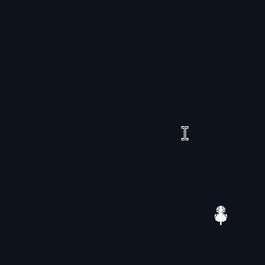

# Oneko Desktop

||A little cat that follows your cursor; screen-wide! (just shy of 2mb!) Making this to practice and get into C++.|
|:---:|:----|
<!-- ||A little cat that follows your cursor; screen-wide! (just shy of 2mb!) Making this to practice and get into C++.| -->

`src/dist` has an executable, so you don't have to build from scratch.

### Example:

## To-do

- [ ] Add support for other actions, right now sitting is the only one that is rendered. 
- [ ] Add better support for custom images. 
- [ ] Learn proper C++ conventions and make the code better/more readable. 
- [ ] Make a Linux version.

## Other

Shoutout to this YouTube video! I learned A LOT from it. \
https://www.youtube.com/watch?v=1s8C9dXRXmM \
(Also used that method for all of the includes.)

For glew, I used this: \
https://github.com/Perlmint/glew-cmake

## License
MIT, view [./LICENSE](./LICENSE).