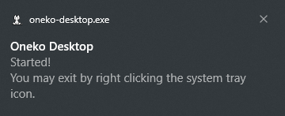

# Oneko Desktop

|  | A little cat that follows your cursor; screen-wide! (just shy of 2mb!) Making this to practice and get into C++. |
| :-----------------------------------: | :------------------------------------------------------------------------------------------------------------------- |

Made this to practice and get into C++. \
`src/dist` has an executable, so you don't have to build from scratch.

### UPDATE Aug. 16, 2024
Why are people forking and using this 😭. \
If this gets another fork or star, I might come back and rewrite this project.

    
Images

    
     
    
     
    
    

## To-do

- [ ] Add support for other actions, right now sitting is the only one that is rendered.
- [ ] Add better support for custom images.
- [ ] Learn proper C++ conventions and make the code better/more readable.
- [ ] Make a Linux version.

## Other

Shoutout to this YouTube video! I learned A LOT from it. (Also used that method for all of the includes.)
https://www.youtube.com/watch?v=1s8C9dXRXmM 

For glew, I used this:
https://github.com/Perlmint/glew-cmake

## License

MIT, view [./LICENSE](./LICENSE).
